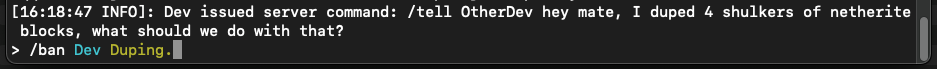
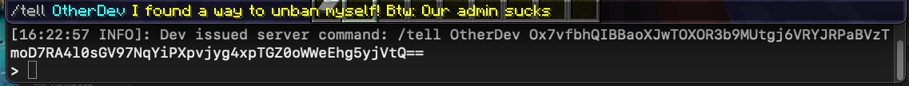
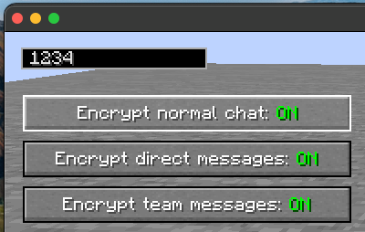

# SMCC

---

**Secure Minecraft Chat**

### Ever had this before? 

### But never again with this mod!

---
Jokes aside, this mod encrypts your messages in Minecraft's chat.
Only available for forge 1.18.1, maybe for other versions and fabric soon™️\
You can configure the key to use for encryption, so you can decide who can
decrypt your messages. You can also configure which messages to encrypt in case you want to only encrypt direct messages to your other hacker-friend for example.

\
**This mod has a uSeRfrIeNdLy and** ***wonderful*** **interface:**\

###### Btw: settings you modify won't get saved across game restarts (for now)
